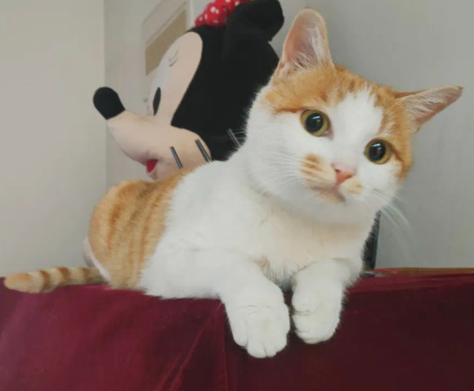
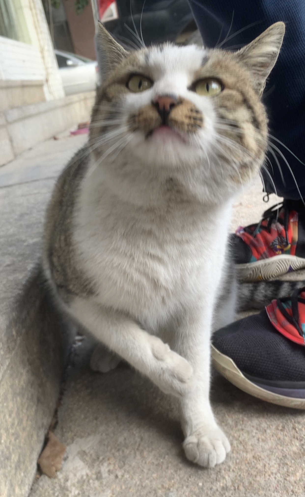

## Jubai Han (韩橘白）
Hello there! My name's Jubai, a radiant ginger cat about to turn two. My first year was filled with trials; I was parted from my mother and faced the wrath of other cats. But just when things looked bleak, my very own Superman swooped in, rescuing me and bringing me to a place I now call home. In my current daily life, I relish the flavors of prawns and steak, but what is the true highlight of my day? I'm eagerly waiting for my mom's return so we can indulge in our favorite game of catch. My heart's deepest desire? To have my mom beside me every single day!

## Zhongwang Wang (王中王）
Hi! I am Zhongwang, a jianzhou cat. In the vast playground beneath Mountain Tai's towering trees, I revel in my freedom, choosing whimsy over stability. Each day, I'm showered with affection from my mother and sister, and I savor the delectable tastes of chicken breast and ham hocks. My cozy den shields me from the cold, and the kind-hearted humans I've met along the way have left paw prints on my heart. Now, as I bask in the joys of Meowstar, surrounded by fellow kittens, I eagerly await my next earthly adventure!

